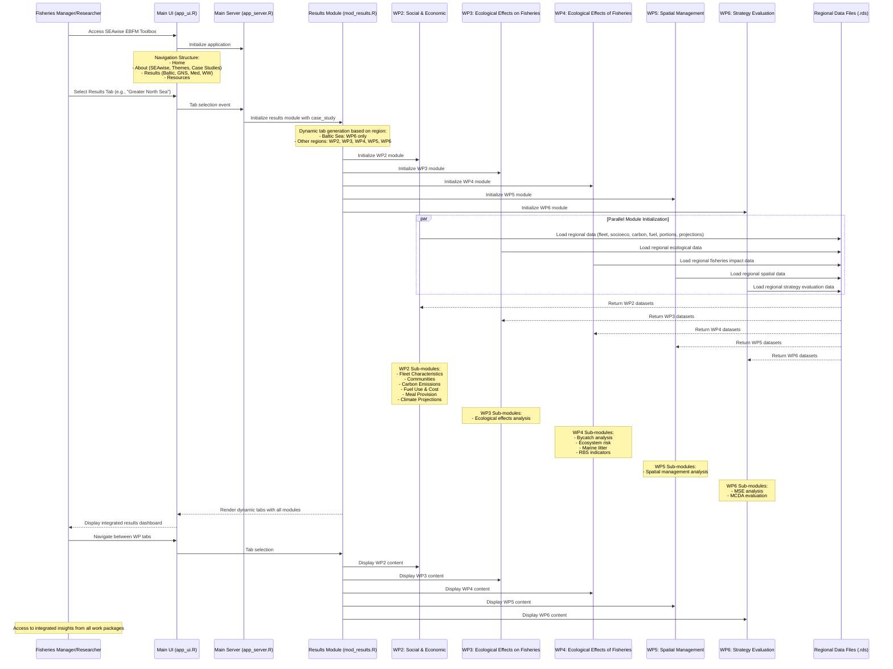

# SEAwise_tool

## Overview

SEAwise_tool is a comprehensive ecosystem-based fisheries management (EBFM) application that serves as the central hub for integrating and displaying outputs from multiple Work Packages (WP2-WP6) of the SEAwise project. This tool provides fisheries managers, researchers, and stakeholders with a unified platform to access and analyze ecosystem-based fisheries management data and insights.

## Purpose

The SEAwise_tool addresses the critical need for integrated ecosystem-based fisheries management by:

- **Centralizing Data**: Consolidating outputs from multiple specialized work packages into a single, accessible interface
- **Supporting Decision-Making**: Providing comprehensive insights for sustainable fisheries management decisions
- **Enabling Ecosystem Approach**: Facilitating the integration of social, economic, and ecological factors in fisheries management
- **Promoting Collaboration**: Creating a unified platform for stakeholders across different domains

## Features

- **Integrated Dashboard**: Single interface to access all work package outputs
- **Cross-Domain Analysis**: Connect insights from social, economic, and ecological assessments
- **Spatial Management Tools**: Support for area-based fisheries management strategies
- **Strategy Evaluation**: Tools for assessing fisheries management strategies in ecosystem context
- **User-Friendly Interface**: Designed for both technical and non-technical users

## System Architecture & Module Interaction

The following sequence diagram illustrates how the SEAwise_tool modules work together to provide integrated ecosystem-based fisheries management insights:

### Key Integration Points:

1. **Shiny Module Architecture**: Main application uses Shiny modules for each work package
2. **Dynamic Tab Generation**: Results module dynamically creates tabs based on selected region
3. **Regional Data Loading**: Each module loads region-specific data files (.rds format)
4. **Conditional Module Display**: Baltic Sea shows only WP6, other regions show all WPs
5. **Sub-module Organization**: Each WP contains specialized analysis sub-modules

### Data Flow:

- **Input**: Regional case study selection (Baltic, GNS, Mediterranean, Western Waters)
- **Processing**: Shiny modules initialize and load region-specific data
- **Integration**: Results module coordinates all WP modules in unified interface
- **Output**: Interactive dashboard with tabs for each work package

### Regional Coverage:

- **Baltic Sea**: Management strategy evaluation (WP6)
- **Greater North Sea**: All work packages (WP2-WP6)
- **Mediterranean**: All work packages with sub-region selection (GSA 17-19, GSA 20)
- **Western Waters**: All work packages with sub-region selection (Celtic Sea, Bay of Biscay)

## Target Users

- **Fisheries Managers**: Government agencies and regulatory bodies
- **Researchers**: Marine scientists and fisheries biologists
- **Stakeholders**: Fishing industry representatives and conservation groups
- **Policy Makers**: Decision-makers involved in marine resource management

## Getting Started

[To be added: Installation instructions, usage examples, and documentation links]

## Contributing

[To be added: Contribution guidelines and development setup]

## License

[To be added: License information]

## Contact

[To be added: Contact information and support details]
